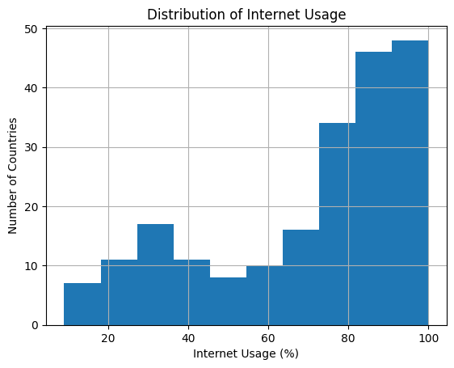
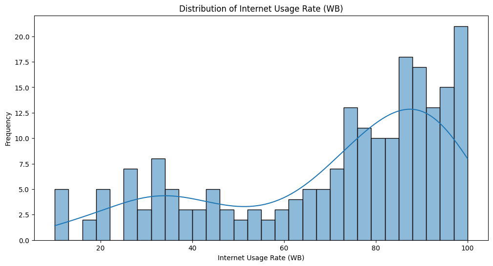
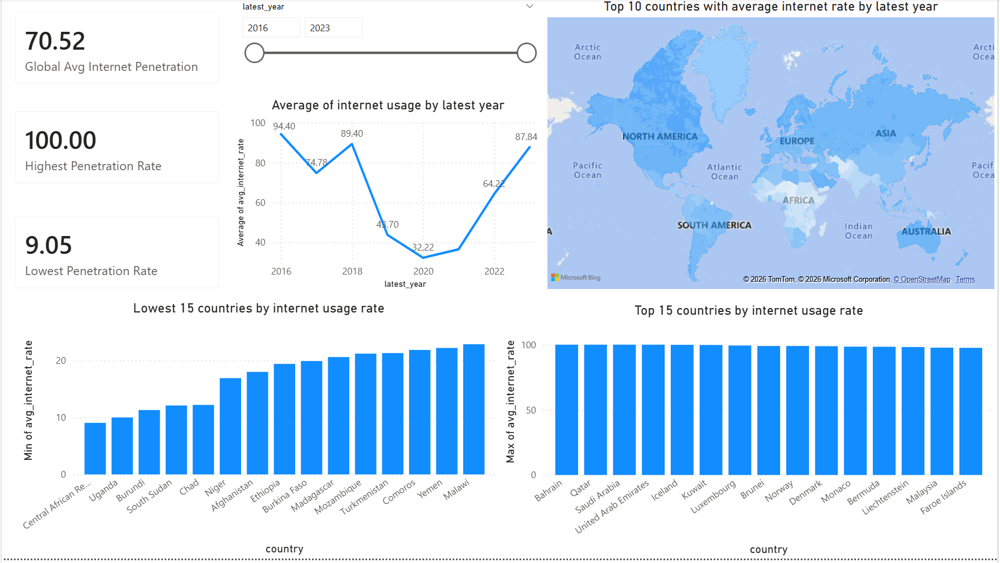

# World-Internet-Usage-Data-Analyst

## Overview
This project analyzes global internet usage trends to uncover insights into digital adoption and its implications for infrastructure demand, particularly in emerging markets.

As internet penetration increases, so does the need for scalable digital infrastructure such as cloud services and data centers. This project simulates real-world market research by transforming raw data into actionable insights.

---

## Tools & Technologies
- Python : Pandas, Matplotlib, Seaborn 
- Power BI: data visualization and dashboard creation
- Data Sources: Kaggle World Internet Usage Data
      - Features: data on the percentage of the population using the internet, sourced from multiple organizations such as the World Bank (WB), International Telecommunication Union (ITU), and the CIA.

---

## Key Insights
Digital Divide: There is a clear gap between develped and developing nations, where developed regions have an internet usage rate exceeding 80-90%. While, in contrast, several developing regions exhibit significantly lower peneration levels, such as below 10%
Growth Opportunities: Emerging markets, particularly in developing regions offers strong growth potential for investment in digital infrastructure.
Trends: Global internet adoption is increasing steadily, reflecting expansion in digital connectivity.

--- 

---
## Python Analysis 
1. # Data Cleaning ([01_data_cleaning.ipynb](https://github.com/YTChiew/World-Internet-Usage-Data-Analyst/blob/main/01_data_cleaning.ipynb))
   - Cleaned data by removing unnecessary columns, null values and inconsistencies across sources (WB, ITU, CIA). 
   - Created a column avg_internet_rate as the average of rate_wb and rate_itu for consistency.
   - Created a column 'latest year' as different years are recorded across year_wb and year_itu.

2. # Data Analysis ([02_data_analysis.ipynb](https://github.com/YTChiew/World-Internet-Usage-Data-Analyst/blob/main/02_analysis.ipynb))
   - Provided summary statistics to highlight global averages, minimums, and maximums, and also to identify digital growth across regions
   - 

        - Shows distribution of internet usage rates across countries.
   - 

        - Smoothed distribution of rate_wb to understand data spread.

---

## Dashboard (Power BI) [Download Power BI Dashboard (.pbix)]()
The interactive dashboard visualizes:

# World Map
- Displays internet penetration by country (via gradient)
- Highlights regions with saturated vs underserved markets

# Bar Charts
- Top and Bottom 15 countries by internet penetratin
- Helps quickly identify mature and emerging markets

# Line graph
- Displays average global internet penetration over time
- Higlights trends in adoption and the digital divide between countries
- *Insight Gained*: The average global internet penetration has fluctuated over the years, with a low point around 2020 (~32%) and a recovery to ~88% by 2023. This trend highlights that data coverage varies across years, but overall, internet adoption has been steadily increasing, reflecting growth in digital connectivity worldwide. While there are a sharp drop, this is likely reflected on data availability, instead of an actual decline. 

--- 
# Dashboard Preview

